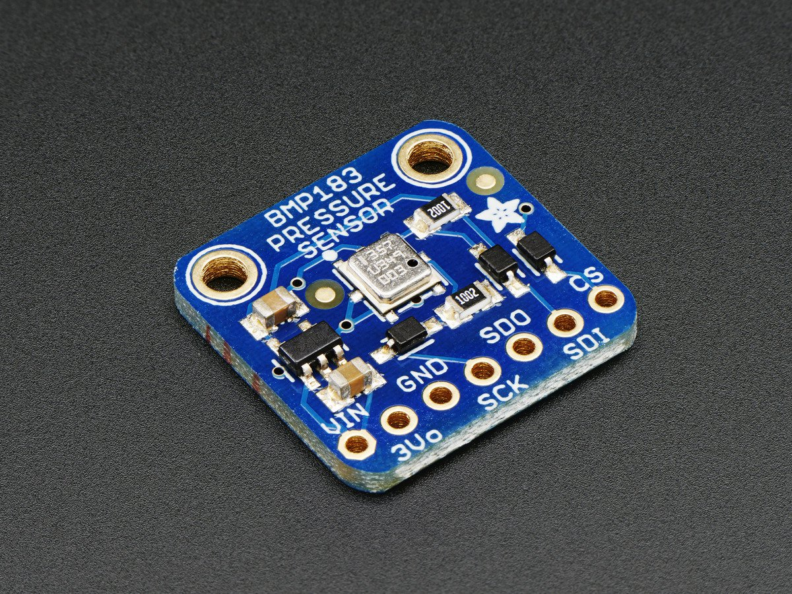

# Adafruit BMP183 

This is a library for the Adafruit BMP183 Barometric Pressure + Temp sensor

Pick one up today in the adafruit shop!
  * https://www.adafruit.com/products/1900

These Sensors use SPI to communicate, 4 pins are required to interface

To install, use the Arduino Library Manager and search for "Adafruit BMP183" and install the library.

Adafruit invests time and resources providing this open source code, 
please support Adafruit and open-source hardware by purchasing 
products from Adafruit!

Check out the links above for our tutorials and wiring diagrams 

Written by Limor Fried/Ladyada for Adafruit Industries.  
BSD license, all text above must be included in any redistribution
All text above must be included in any redistribution
